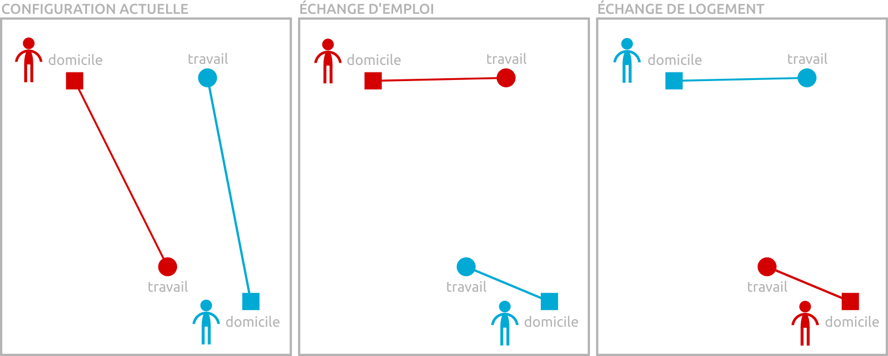

## Présentation du projet

L'automobile est au coeur d'un système d'externalités négatives bien renseigné qui affecte la santé publique via la pollution locale et l'accidentologie, qui nuit à l'environnement local et mondial via sa participation au changement climatique, et qui consomme une part importante de l'espace urbain. L'Ile-de-France, de plus en plus connue pour ses pics de pollution et ses embouteillages à répétition, offre un cas particulièrement intéressant pour penser une sortie de l'automobile. Elle présente à la fois une agglomération dense où l'utilisation de l'automobile diminue et des espaces périphériques (espaces ruraux et villes secondaires), moins pourvus en transports alternatifs, où son usage continue de croître.

Le projet [Postcar Île-de-France](http://fr.forumviesmobiles.org/projet/2017/02/27/post-car-ile-france-3516) est une collaboration de recherche entre le laboratoire [Géographie-Cités](http://parisgeo.cnrs.fr) et le [Forum des Vies Mobiles](http://fr.forumviesmobiles.org). Le laboratoire Géographie-cités a composé une équipe réunissant des compétences pluridisciplinaires d'aménagement-urbanisme ([Jean Debrie](http://www.parisgeo.cnrs.fr/spip.php?article5684&lang=fr), [Juliette Maulat](http://www.parisgeo.cnrs.fr/spip.php?article324&lang=fr), de géographie urbaine ([Sandrine Berroir](http://www.parisgeo.cnrs.fr/spip.php?article51&lang=fr) et de modélisation en géographie ([Arnaud Banos](http://www.parisgeo.cnrs.fr/spip.php?article5&lang=fr), [Hadrien Commenges](http://www.parisgeo.cnrs.fr/spip.php?article87&lang=fr). Les chercheurs sont accompagnés par les étudiants d'un atelier du master Aménagement-Urbanisme (Univ. Paris 1) et du master Carthagéo (Univ. Paris 1, Univ. Paris 7, ENSG).

## Citation

- **pour l'application :**
	- COMMENGES Hadrien (2018) *Améginat-IF : aménager en imaginant l'Île-de-France*, UMR 8504 Géographie-cités.

- **pour les données :**
	- fond de carte : OpenStreetMap, Carto.DB, leaflet
	- délimitations administratives : IGN, Base municipale Geofla 2012
	- temps de transport : DRIEA-IF, Matrices de temps de transport du modèle MODUS
	- navettes domicile-travail : Insee, Recensement de la population 2012
	- équipements : Insee, Base Permanente des Équipements 2012
	- mode d'occupation du sol : IAU-IdF, Valise EVOLUMOS 2012

## Accès à l'application et au code

- Accès à l'application Améginat-IF sur le serveur de l'UMR 8504 Géographie-cités : http://shiny.parisgeo.cnrs.fr/ameginatif
- Accès à l'application Améginat-IF sur le serveur du TGIR Huma-Num : https://analytics.huma-num.fr/Hadrien.Commenges/ameginatif
- Accès au code de l'application sur le dépot Github : https://github.com/Geographie-cites/ameginatif

## Description des analyses

Plusieurs aspects de l'organisation des populations, des activités et des mobilités peuvent être contrôlés :

- **la localisation des populations et des activités :** cette section permet une redistribution selon quatre archétypes.
	- **Configuration actuelle :** répartition actuelle (selon le recensement 2012) des actifs résidents et des emplois
	- **Finger plan :** concentration des résidents et des emplois dans les communes desservies par le réseau de transport ferré (métro, RER, transilien)
	- **Transport-oriented development :** concentration des résidents et des emplois dans les pôles d'emploi desservis par le réseau de transport ferré
	- **Polycentrisation :** répartition inchangée pour les résidents, concentration des emplois dans les pôles d'emploi desservis par le réseau de transport ferré
	- **CBDsation :** concentration de tous les emplois franciliens dans Paris, déplacement de tous les résidents parisiens en petite et grande couronne

- **la mobilité quotidienne et résidentielle :** il s'agit de relier les domiciles et les lieux d'emploi pour minimiser la distance parcourue (voir figure).

 
	- **Configuration actuelle :** déplacements domicile-travail actuels
	- **Échange d'emploi selon catégorie socio-professionnelle :** chaque actif échange son emploi avec un autre actif pour travailler le plus près possible de son domicile. Cet échange se fait au sein de la même catégorie d'activité (un agriculteur échange avec un autre agriculteur, un commerçant avec un autre commerçant, etc.)
	- **Échange de logement selon type de logement :** chaque actif échange son domicile avec un autre actif pour s'installer le plus près possible de son emploi. Cet échange se fait au sein de la même catégorie de logement (échange d'appartement contre un appartement, échange de máison contre maison, etc.)
	- **Échange sans contrainte :** échange au plus proche sans contrainte (un agriculteur peut échanger avec un commerçant ou un cadre avec un ouvrier s'il s'agit de l'emploi ; une maison peut être échangée avec un appartement s'il s'agit du domicile). Dans ce cas l'échange d'emploi ou de domicile est équivalent sur la distance finale parcourue (voir figure ci-dessus).

- **la localisation des équipements :** cette section permet un redistribution de l'ensemble des équipements (boulangeries, écoles, hôpitaux, etc.) ce qui a un effet sur les mobilités quotidiennes pour d'autres motifs que le travail.
	- **Configuration actuelle :** localisation actuelle selon la Base Permanente des Équipements 2012. Si les populations et les activités sont redistribuées la configuration actuelle des équipements n'a pas de sens : par exemple si les populations et les activités sont situées exculsivement dans les communes desservies par le transport ferré (*Finger Plan*) les boulangeries, les écoles et tous les autres équipements devraient être redistribués en conséquence.
	- **Près des résidents :** localisation des équipements selon la localisation des résidents
	- **Près des emplois :** localisation des équipements selon la localisation des emplois
	- **Équilibre résidents-emplois :** localisation des équipements selon la localisation résidents et des emplois

- **le mode de transport :** cette section permet d'agir sur le mode de transport utilisé pour l'ensemble des déplacements quotidiens.
	- **Configuration actuelle :** temps et distance par mode de transport selon le recensement de la population 2012 et l'Enquête Globale Transport 2010. La voiture désigne plus généralement tous les véhicules motorisés individuels (véhicules motorisés à deux, trois et quatre roues). Le transport collectif inclut tous les modes collectifs et/ou publics (bus, métro, taxi). Les modes doux désignent les modes non motorisés (*human powered*), principalement la marche à pied et le vélo.
	- **Zéro voiture :** suppression de la voiture, report modal sur le transport collectf (pour les déplacements supérieurs à 2 km) et sur les modes doux (pour les déplacements inférieurs à 2km).
	- **Tout voiture :** report modal complet des modes doux et du transport collectif vers la voiture.
	- **Zéro transport collectif :** suppression du transport collectif, report modal sur la voiture (pour les déplacements supérieurs à 2 km) et sur les modes doux (pour les déplacements inférieurs à 2km).
	- **Tout transport collectif :** report modal complet des modes doux et de la voiture vers le transport collectif.
	- **Zéro modes doux :** suppression des modes non motorisés, report modal sur le transport en commun et sur la voiture à parts égales.
	- **Tout modes doux :** report modal complet de la voiture et du transport collectif vers les modes doux.

### Bibliographie

- Sur l'*excess commuting* (`Agir sur les mobilités`), voir XXX

