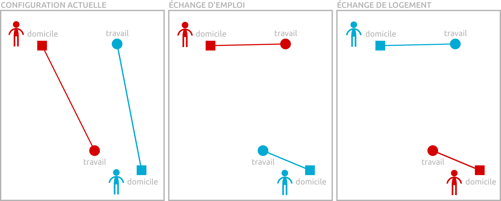

## Description

Plusieurs aspects de l'organisation socio-spatiale de l'Île-de-France peuvent être contrôlés : la localisation des populations et des activités, les mobilités quotidienne et résidentielle, et l'utilisation des modes de transport.

### Localisation des populations et des activités 

Il s'agit de relocaliser les actifs et les emplois selon des modèles urbains connus.

- **Configuration actuelle :** répartition actuelle (selon le recensement 2014) des actifs résidents et des emplois
- **Finger plan :** concentration des résidents et des emplois dans les communes desservies par le réseau de transport ferré (métro, RER, transilien)
- **Transport-oriented development :** concentration des résidents et des emplois dans les pôles d'emploi desservis par le réseau de transport ferré
- **Polycentrisation :** répartition inchangée pour les résidents, concentration des emplois dans les pôles d'emploi desservis par le réseau de transport ferré
- **CBDsation :** concentration de tous les emplois franciliens dans Paris, déplacement de tous les résidents parisiens en petite et grande couronne

### Mobilité quotidienne et mobilité résidentielle

Il s'agit de relier les domiciles et les lieux d'emploi pour minimiser la distance parcourue (voir figure).

- **Configuration actuelle :** déplacements domicile-travail actuels
- **Échange d'emploi :** chaque actif échange son emploi avec un autre actif pour travailler le plus près possible de son domicile. Cet échange se fait au sein de la même catégorie d'activité (un agriculteur échange avec un autre agriculteur, un commerçant avec un autre commerçant, etc.)
- **Échange de logement :** chaque actif échange son domicile avec un autre actif pour s'installer le plus près possible de son emploi. Cet échange se fait au sein de la même catégorie de logement (échange d'appartement contre un appartement, échange de máison contre maison, etc.)

### Mode de transport

Cette section permet d'agir sur le mode de transport utilisé pour l'ensemble des déplacements domicile-travail. Le mode **voiture** désigne plus généralement tous les véhicules motorisés individuels (véhicules motorisés à deux, trois et quatre roues). Le transport collectif inclut tous les modes collectifs et/ou publics (bus, métro, taxi). Les modes doux désignent les modes non motorisés (*human powered*), principalement la marche à pied et le vélo.

- **Configuration actuelle :** répartition modale actuelle. 
- **Zéro voiture :** suppression de la voiture, report modal sur le transport collectf (pour les déplacements supérieurs à 1,5 km) et sur les modes doux (pour les déplacements inférieurs à 1,5 km).
- **Tout voiture :** report modal complet des modes doux et du transport collectif vers la voiture.
- **Zéro transport collectif :** suppression du transport collectif, report modal sur la voiture (pour les déplacements supérieurs à 1,5 km) et sur les modes doux (pour les déplacements inférieurs à 1,5 km).
- **Tout transport collectif :** report modal complet des modes doux et de la voiture vers le transport collectif.
- **Zéro modes doux :** suppression des modes non motorisés, report modal sur le transport en commun et sur la voiture à parts égales.
- **Tout modes doux :** report modal complet de la voiture et du transport collectif vers les modes doux.

